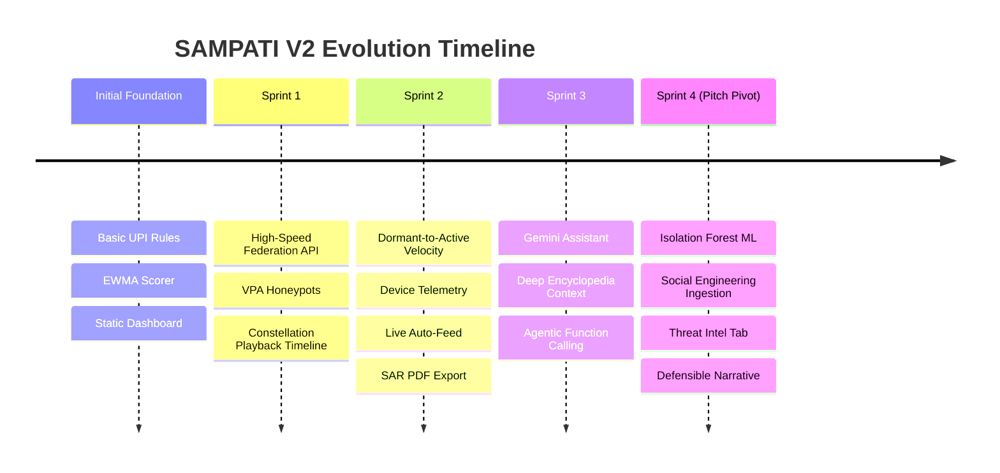

# SAMPATI V2 — Project Evolution & Architectural Milestone Report

> **Core Philosophy:** *“Everyone sees a piece. SAMPATI connects the dots.”*  
> **Product Principle:** *Don't detect only after the money moves. Detect the social engineering and threat infrastructure before the transaction happens.*

---

## 1. Where We Started vs. Where We Are

| Dimension | Day 1 / Initial State | Present State (SAMPATI V2.1 Mesh) |
| :--- | :--- | :--- |
| **Architectural Scope** | Single-bank post-transaction UPI scorer | **Collaborative Fraud-Intelligence Mesh** (App + PSP + Bank + Platform) |
| **Detection Timing** | Reactive (after money moves) | **Pre-Transaction Early Warning + Real-Time Transaction Scoring + Post-Transaction Graph Clustering** |
| **Machine Learning** | Basic heuristic math (EWMA anomaly) | **Multi-Layer Hybrid**: 19 Deterministic Rules + Adaptive Model + **Unsupervised Isolation Forest ML (`ml_anomaly_score`)** + Network Graph Score |
| **Social Engineering** | None (pure numerical transaction inputs) | **Automated Entity & Scam Signal Extraction** (SMS text, Phone, VPA, Phishing URL, Urgency / Authority Impersonation) |
| **Network Intelligence** | Static canvas drawing | **Dynamic NetworkX Multi-Hop Graph** with chronological playback timeline & real-time ring discovery |
| **Cross-Institution Federation**| Stub file | **High-Speed Cryptographic Signal Exchange** (<5ms hot cache query, zero customer PII leakage) |
| **Autonomous Capabilities** | Manual single-check API calls | **Autonomous Live Auto-Feed** (10–50 TPS background rail simulation) + **Gemini Assistant Agentic Function Calling** (Block, Simulate, Federate, SAR PDF) |
| **UI Polish & Interactivity** | Static dashboard, dead buttons, 0 toasts | **Fully Reactive React/Vite SPA**, Framer Motion Toasts, Dedicated `/threat-intel` console, Interactive Analytics Heatmap (7×24) |
| **Terminology & Credibility** | High buzzword risk (*“100% confidence”*, *“Criminal Mafia”*, *“Dead Money”*) | **Defensible Fintech Standards**: *“Dormant-to-Active Velocity”*, *“Suspected Mule Cluster”*, *“Signal Correlation”* |
| **Test Coverage & Quality** | ~490 tests | **902 Passing Tests** (Unit + E2E + Adversarial Challenger + Contracts), 0 Ruff warnings, 0 ESLint warnings |

---

## 2. Chronological Milestones & What Was Built



### Milestone 1: Core Federation, Honeypots & Playback Timeline
- **High-Speed Federation Engine (`app/api/federation.py`)**: Sub-5ms hot-cache query engine (`POST /federation/signal`, `GET /federation/query`) allowing institutions to share threat vectors without customer identities.
- **Honeypot Network (`app/engine/honeypot.py`)**: Synthetic VPA registry detecting probe transfers; triggers `R_HONEYPOT_HIT` for immediate block verdict.
- **Forensic Playback Timeline (`NetworkConstellation.jsx`)**: Interactive time-slider that animates mule rings forming hop-by-hop in timestamp order.

### Milestone 2: Telemetry Enrichment & Autonomous Auto-Feed
- **Dormant-to-Active Velocity (DAV / DMV)**: Algorithms quantifying dormant accounts that abruptly drain balances into downstream hops.
- **3 Device Telemetry Rules**: SIM-Device Mismatch (`R_SIM_DEVICE_MISMATCH`), Impossible Travel (`R_IMPOSSIBLE_TRAVEL`), and Datacenter/VPN IP detection (`R_DATACENTER_IP`).
- **Campaign DNA Fingerprinting**: Cosine similarity clustering matching new transaction behavior against historical fraud templates (`R_CAMPAIGN_MATCH`).
- **Automated SAR PDF Generator**: Complete regulatory Suspicious Activity Report generation with embedded ring topology diagrams via ReportLab (`GET /cases/{case_id}/sar/pdf`).
- **Autonomous Live Auto-Feed**: Background loop (`/upi/autofeed/start`) generating configurable bursts (5–50 TPS) through the live pipeline with real-time WebSocket broadcasting.
- **Analyst Workload Heatmap**: 7×24 day-by-hour visual matrix of flagged case volume.

### Milestone 3: Gemini Assistant & Agentic Operations
- **Full Domain Knowledge Injection**: Injected platform architecture, algorithm formulations, and all 19 rules from `ENCYCLOPEDIA.md` directly into the LLM system prompt.
- **Autonomous Tool Execution (Function Calling)**:
  - `block_vpa`: Instant blacklist enforcement.
  - `run_simulation`: Inject synthetic fraud batches on demand.
  - `trigger_federation`: Synchronize threat signals across mock network nodes.
  - `export_sar`: Compile forensic PDF reports directly from chat.
- **Interactive UI (`CaseGeminiAssistantView.jsx`)**: Reactive chat with live `ToolExecutionCard` action statuses.

### Milestone 4: The Strategic Pivot & Collaborative Threat Mesh
- **Unsupervised Isolation Forest Model (`app/engine/isolation_forest.py`)**:
  - 13-dimensional feature vectors (amount, hour sin/cos, velocity, account age, hops).
  - Pure scikit-learn / NumPy implementation with sub-millisecond inference latency.
  - Returns `ml_anomaly_score` (0.00 – 1.00) and factors into Layer 4 risk scoring.
- **Pre-Transaction Threat Intelligence Backend (`app/api/intel.py`)**:
  - Ingestion routes (`POST /intel/signals`, `GET /intel/campaigns`, `GET /intel/graph`).
  - Regex-based entity extractor pulling Indian mobile numbers (+91), UPI handles (`@okaxis`, `@upi`, etc.), and phishing URLs.
  - Social engineering intent classifier flagging Authority Impersonation, KYC Threats, Urgency, and Advance Fee scams.
- **Central Fraud Graph (`app/services/graph_service.py`)**: NetworkX directed multigraph interconnecting phone numbers, VPAs, URLs, and bank accounts into campaign clusters.
- **Dedicated Threat Intelligence View (`ThreatIntelPage.jsx`)**:
  - Live pre-transaction threat feed with realistic SMS scam simulations (SBI KYC Phishing, Telegram Task Scam, Electricity Bill Disconnection).
  - Campaign clustering cards displaying similarity percentages (e.g. 94% match).
  - Visual Entity Extraction pipeline showing SMS → Extracted Identifiers → Graph Linkage.
- **Global Buzzword Deprecation**: Complete sanitization of overambitious claims to prepare for technical judges.
- **Reactive Toast Notification Engine (`ToastContext.jsx`, `ToastContainer.jsx`)**: Instant feedback on all operational buttons.

---

## 3. The 5-Stage Threat Lifecycle in Action

```
[ STAGE 1: PRE-TRANSACTION ]
📱 SAMPATI Mobile App / User Sensor
└── Scam SMS received ("Your SBI account is blocked. Pay Rs 2 to sbi.verify@oksbi to restore.")
└── Entity Extractor parses: Phone (+919876543210), VPA (sbi.verify@oksbi), URL, Urgency tag
└── Dispatches threat signal to backend (POST /intel/signals)
                    │
                    ▼
[ STAGE 2: INTELLIGENCE CORRELATION ]
🧠 SAMPATI Graph & Campaign Engine
└── NetworkX Graph correlates VPA + Phone with existing clusters
└── Discovers 94% campaign similarity with "KYC Phishing Syndicate"
└── Flags identifier across the federated mesh hot cache (<5ms)
                    │
                    ▼
[ STAGE 3: TRANSACTION EVALUATION ]
💳 Real-Time Payment Scoring (/upi/check)
└── Payer attempts transfer to sbi.verify@oksbi
└── 4-Layer Scoring runs:
    ├─ Layer 1: Deterministic Rules (R01-R07 + Honeypot + Telemetry)
    ├─ Layer 2: Adaptive Behavioral Score (EWMA)
    ├─ Layer 3: Federated Mesh Network Score
    └─ Layer 4: Unsupervised Isolation Forest Anomaly Score (ml_anomaly_score)
                    │
                    ▼
[ STAGE 4: ACTION & ALERT ]
🚨 Automated Risk Mitigation
└── Verdict: BLOCK (Risk Score: 96/100)
└── Live feed & WebSocket notification triggers on Overview dashboard
└── Toast notification dispatched: "Threat Neutralized"
                    │
                    ▼
[ STAGE 5: INVESTIGATION & REGULATORY COMPLIANCE ]
📂 Analyst Console & Regulatory SAR
└── Case opened in Investigations drawer with Dormant-to-Active gauge & topology
└── Gemini Assistant generates natural language forensic briefing
└── One-click SAR PDF downloaded with cryptographic audit trail
```

---

## 4. Current Quality & Verification Metrics

- **Backend Pytest Suite**: **902 passed**, 0 failed across 5 tiers.
- **Static Code Analysis**: `ruff check app tests` → **Clean (0 errors)**.
- **Frontend Code Quality**: `eslint src --max-warnings 0` → **Clean (0 warnings)**.
- **Production Build**: `npm run build` → **Clean Vite compilation**.
- **Deployment Status**: Main branch synchronized with `git@github.com:404Avinash/SAMPATI_V2.git` (`8776e69`).

---

## 5. Judge Pitch Cheat-Sheet

| Judge Question | The Winning Answer |
| :--- | :--- |
| *“How do you get SBI, HDFC, and PhonePe to share private data with you?”* | **“They don't share customer data. They share signals.** SAMPATI is designed as an open participation layer where institutions and user apps exchange privacy-preserving mathematical threat indicators through standardized adapters.” |
| *“Why not just use a deep learning black box?”* | **“Financial fraud requires deterministic explainability and sub-10ms response times.** We use an unsupervised Isolation Forest for multivariate anomaly detection alongside deterministic banking rules, giving analysts transparent, auditable breakdown points for regulatory SAR filing.” |
| *“Are you claiming you mapped the entire criminal mafia?”* | **“No. We identify high-risk behavioral clusters and suspected mule networks.** We connect fragmented dots across phone numbers, VPAs, URLs, and transaction velocity so banks don't operate in silos.” |
| *“What is your core USP?”* | **“Everyone sees a piece. SAMPATI connects the dots.** We catch the social engineering infrastructure before the money moves, correlate it with payment anomalies, and flag the mule cluster before the next victim pays.” |
